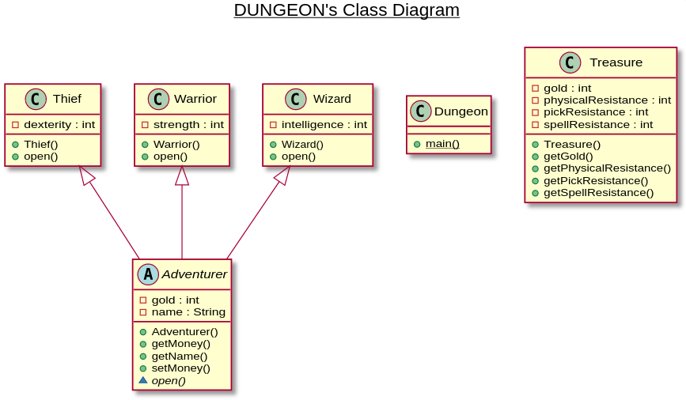

# DUNGEON

You are the dungeon master : your party of adventurers has slain the dragon, now they want to share the gold of each treasure.

Instead of opening all the treasures and share the amount equally, the party has decided to open one treasure at a time : the adventurer keeping the gold he found inside.

But there is a catch! Each treasure has many forms of protection : a physical resistance, a spell resistance and a lockpicking resistance.

Each adventurer will try to open the next treasure, if it doesn't succeed, the treasure is magically destroyed!

* The warrior will use his brute force, relying on his strength.
* The wizard will use a spell, relying on his intelligence.
* The thief will use a lock pick, relying on his dexterity.

You'll have to create the classes, has shown on this class diagram :

Then, modify the `Dungeon` main function to implement the creation of the party members and the treasures opening.

After that, you're free to improve the program : you can add battles with monsters, random traps, a dungeon represented as a two-dimensional array...